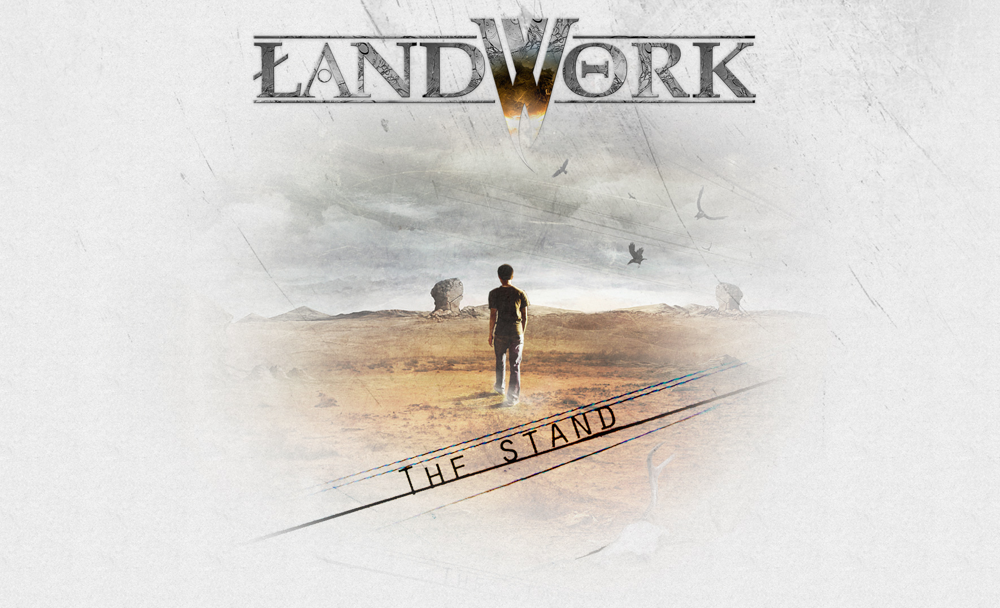
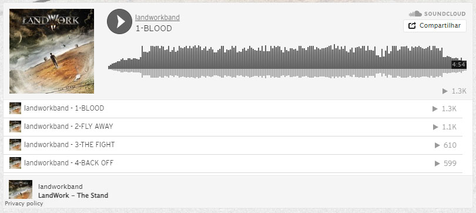
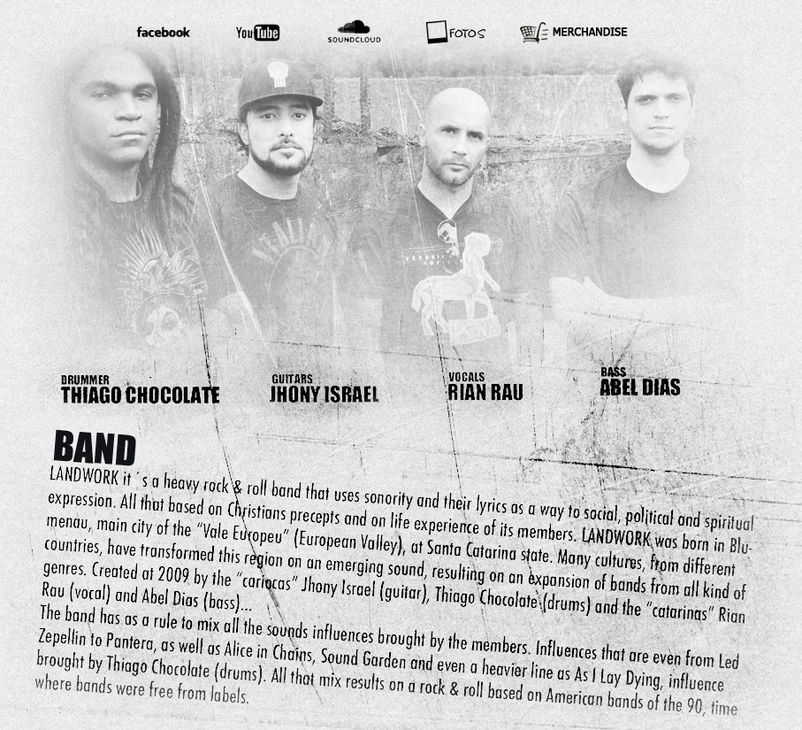
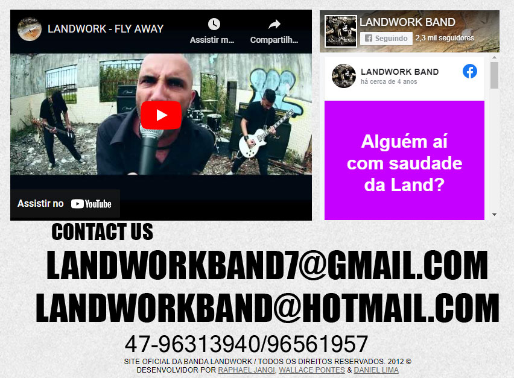

# LANDWORK BAND

Antigo site da Landwork Band que é uma banda de metal do município de Blumenau, Santa Catarina.

## Criação

> ⚠️ **Atenção:** Site criado em abril de 2013 com código feito por mim e Raphael Jangi e design feito por Daniel Lima.

O site foi criado basicamente em um dia no Dreamweaver utilizando uma imagem em PSD com camadas separadas criada pelo Daniel Lima.

### cabeçalho



O cabeçalho do site começa com a capa do álbum "The Stand" criado pelo Daniel Lima.

### Player



Seguido por um *iframe* do [Soundcloud](https://soundcloud.com/landworkband/sets/landwork-the-stand) contendo todas as músicas do álbum.

### Banda



Apresentação da banda junto com os links das redes sociais e uma pequena galeria de fotos usando o *fancybox*:

```javascript
$(document).ready(function() {
   /*
    *  Simple image gallery. Uses default settings
    */

   $('.fancybox').fancybox();

   /*
    *  Different effects
    */

   // Change title type, overlay closing speed
   $(".fancybox-effects-a").fancybox({
    helpers: {
     title : {
      type : 'outside'
     },
     overlay : {
      speedOut : 0
     }
    }
   });

   // Disable opening and closing animations, change title type
   $(".fancybox-effects-b").fancybox({
    openEffect  : 'none',
    closeEffect : 'none',

    helpers : {
     title : {
      type : 'over'
     }
    }
   });

   // Set custom style, close if clicked, change title type and overlay color
   $(".fancybox-effects-c").fancybox({
    wrapCSS    : 'fancybox-custom',
    closeClick : true,

    openEffect : 'none',

    helpers : {
     title : {
      type : 'inside'
     },
     overlay : {
      css : {
       'background' : 'rgba(238,238,238,0.85)'
      }
     }
    }
   });

   // Remove padding, set opening and closing animations, close if clicked and disable overlay
   $(".fancybox-effects-d").fancybox({
    padding: 0,

    openEffect : 'elastic',
    openSpeed  : 150,

    closeEffect : 'elastic',
    closeSpeed  : 150,

    closeClick : true,

    helpers : {
     overlay : null
    }
   });

   /*
    *  Button helper. Disable animations, hide close button, change title type and content
    */

   $('.fancybox-buttons').fancybox({
    openEffect  : 'none',
    closeEffect : 'none',

    prevEffect : 'none',
    nextEffect : 'none',

    closeBtn  : false,

    helpers : {
     title : {
      type : 'inside'
     },
     buttons : {}
    },

    afterLoad : function() {
     this.title = 'Image ' + (this.index + 1) + ' of ' + this.group.length + (this.title ? ' - ' + this.title : '');
    }
   });


   /*
    *  Thumbnail helper. Disable animations, hide close button, arrows and slide to next gallery item if clicked
    */

   $('.fancybox-thumbs').fancybox({
    prevEffect : 'none',
    nextEffect : 'none',

    closeBtn  : false,
    arrows    : false,
    nextClick : true,

    helpers : {
     thumbs : {
      width  : 50,
      height : 50
     }
    }
   });

   /*
    *  Media helper. Group items, disable animations, hide arrows, enable media and button helpers.
   */
   $('.fancybox-media')
    .attr('rel', 'media-gallery')
    .fancybox({
     openEffect : 'none',
     closeEffect : 'none',
     prevEffect : 'none',
     nextEffect : 'none',

     arrows : false,
     helpers : {
      media : {},
      buttons : {}
     }
    });

   /*
    *  uhuuuu
    */


   $("#fancybox-manual-c").click(function() {
    $.fancybox.open([
     {
      href : 'fotos/001.jpg',
     }, {
      href : 'fotos/002.jpg',
     }, {
      href : 'fotos/003.jpg'
     }
    ], {
     helpers : {
      thumbs : {
       width: 75,
       height: 50
      }
     }
    });
   });


  });
  
  $(document).ready(function() {
 $(".various").fancybox({
  maxWidth : 800,
  maxHeight : 600,
  fitToView : false,
  width  : '70%',
  height  : '70%',
  autoSize : false,
  closeClick : false,
  openEffect : 'none',
  closeEffect : 'none'
 });
});
```

### Rodapé



E finalizando com um *iframe* do player do [YouTube](https://youtu.be/Puq3FV5oCTc), um *iframe* da página do [Facebook](https://www.facebook.com/LANDWORKBAND/) e contatos.